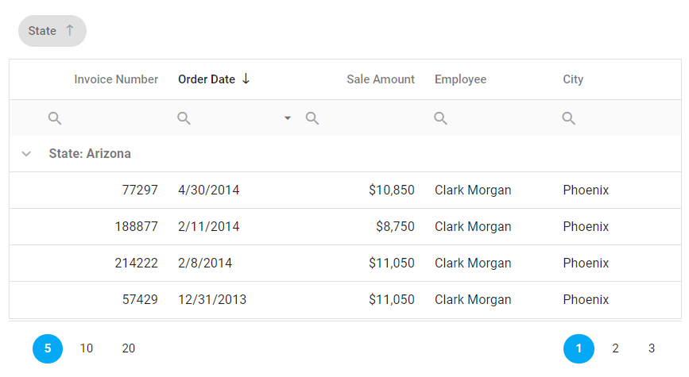

<!-- default badges list -->

<!-- default badges end -->
# DevExtreme DataGrid - How to modify the persisted state

This example shows how to exclude component settings that you don't need restored after the page is reloaded.

In this example, you can reorder grid columns, sort and group data, and perform other modifications in the UI. After you reload the page, all modifications will persist, except filters applied to grid columns.

You can use the demonstrated approach with the following UI components:

- [DataGrid](https://js.devexpress.com/Documentation/Guide/UI_Components/DataGrid/Getting_Started_with_DataGrid/)
- [TreeList](https://js.devexpress.com/Documentation/Guide/UI_Components/TreeList/Getting_Started_with_TreeList/)
- [PivotGrid](https://js.devexpress.com/Documentation/Guide/UI_Components/PivotGrid/Getting_Started_with_PivotGrid/)

## Implementation Steps

1. **Switch state storing into manual mode**        
Set [stateStoring](https://js.devexpress.com/Documentation/ApiReference/UI_Components/dxDataGrid/Configuration/stateStoring/).[type](https://js.devexpress.com/Documentation/ApiReference/UI_Components/dxDataGrid/Configuration/stateStoring/#type) to *"custom"*.

1. **Implement the [customSave](https://js.devexpress.com/Documentation/ApiReference/UI_Components/dxDataGrid/Configuration/stateStoring/#customSave) and [customLoad](https://js.devexpress.com/Documentation/ApiReference/UI_Components/dxDataGrid/Configuration/stateStoring/#customLoad) functions**        
**customSave** should modify the state and save it to your storage; **customLoad** should load the state from the storage and return it to the UI component. In this example, **customSave** removes filters applied to grid columns.

## Files to Review

- **jQuery**
    - [index.js](jQuery/src/index.js#L44-L59)
- **Angular**
    - [app.component.html](Angular/src/app/app.component.html#L37-L43)
    - [app.component.ts](Angular/src/app/app.component.ts#L17-L27)
- **Vue**
    - [Home.vue](Vue/src/components/Home.vue#L80-L90)
- **React**
    - [App.js](React/src/App.js#L22-L33)

## Documentation

- [DataGrid - stateStoring API](https://js.devexpress.com/Documentation/ApiReference/UI_Components/dxDataGrid/Configuration/stateStoring/)
- [Getting Started with DataGrid](https://js.devexpress.com/Documentation/Guide/UI_Components/DataGrid/Getting_Started_with_DataGrid/)

## More Examples

- [DataGrid State Persistence Demo](https://js.devexpress.com/Demos/WidgetsGallery/Demo/DataGrid/StatePersistence)